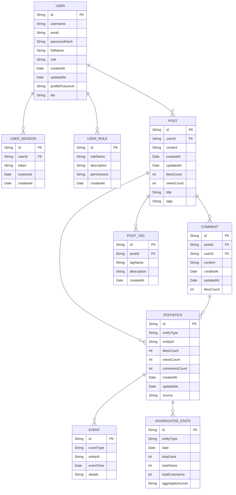

# Общая ER-диаграмма

```mermaid
erDiagram
    %% Сервис пользователей %%
    USER {
        String id PK
        String username
        String email
        String passwordHash
        String fullName
        String role
        Date createdAt
        Date updatedAt
        String profilePictureUrl
        String bio
    }

    USER_SESSION {
        String id PK
        String userId FK
        String token
        Date expiresAt
        Date createdAt
    }

    USER_ROLE {
        String id PK
        String roleName
        String description
        String permissions
        Date createdAt
    }

    %% Сервис постов и комментариев %%
    POST {
        String id PK
        String userId FK
        String content
        Date createdAt
        Date updatedAt
        int likesCount
        int viewsCount
        String title
        String tags
    }

    COMMENT {
        String id PK
        String postId FK
        String userId FK
        String content
        Date createdAt
        Date updatedAt
        int likesCount
    }

    POST_TAG {
        String id PK
        String postId FK
        String tagName
        String description
        Date createdAt
    }

    %% Сервис статистики %%
    STATISTICS {
        String id PK
        String entityType
        String entityId
        int likesCount
        int viewsCount
        int commentsCount
        Date createdAt
        Date updatedAt
        String source
    }

    EVENT {
        String id PK
        String eventType
        String entityId
        Date eventTime
        String details
    }

    AGGREGATED_STATS {
        String id PK
        String entityType
        Date date
        int totalLikes
        int totalViews
        int totalComments
        String aggregationLevel
    }

    %% Связи %%
    USER ||--o{ USER_SESSION : ""
    USER ||--o{ USER_ROLE : ""
    USER ||--o{ POST : ""
    POST ||--o{ COMMENT : ""
    POST ||--o{ POST_TAG : ""
    POST ||--o{ STATISTICS : ""
    COMMENT ||--o{ STATISTICS : ""
    STATISTICS ||--o{ EVENT : ""
    STATISTICS ||--o{ AGGREGATED_STATS : ""

```