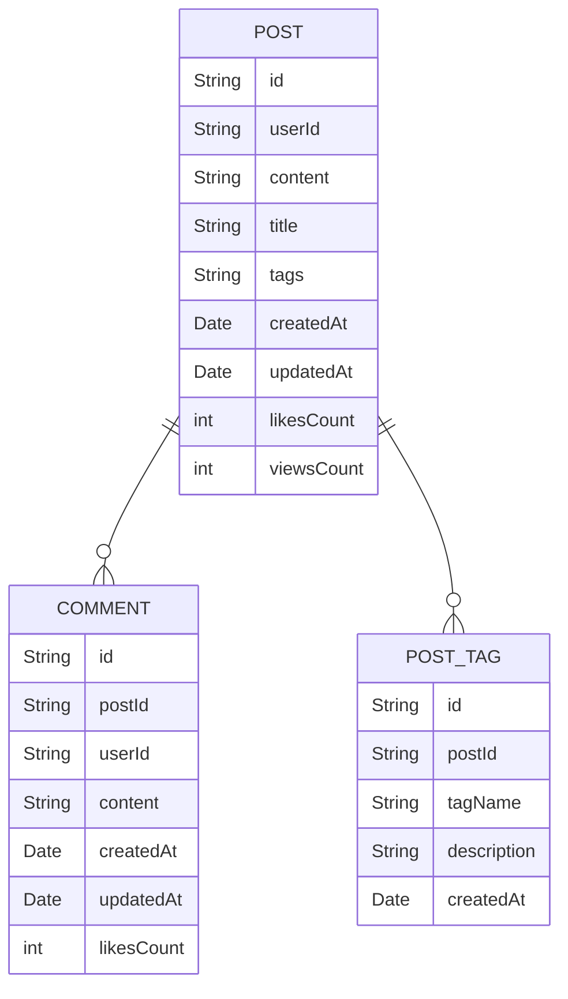

# ER-диаграмма для сервиса постов и комментариев

```mermaid

erDiagram
    POST {
        String id
        String userId
        String content
        String title
        String tags
        Date createdAt
        Date updatedAt
        int likesCount
        int viewsCount
    }

    COMMENT {
        String id
        String postId
        String userId
        String content
        Date createdAt
        Date updatedAt
        int likesCount
    }

    POST_TAG {
        String id
        String postId
        String tagName
        String description
        Date createdAt
    }


    POST ||--o{ COMMENT : ""
    POST ||--o{ POST_TAG : ""
```