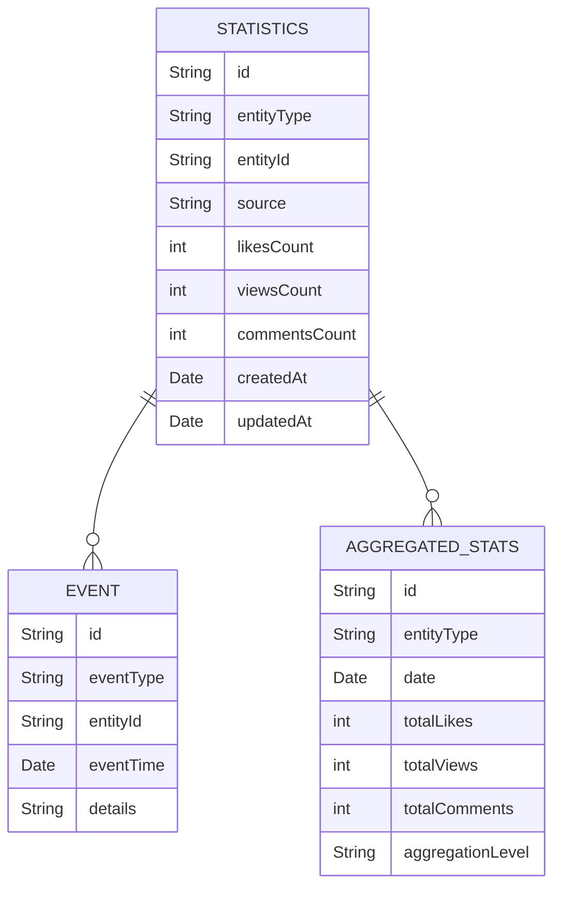

# ER-диаграмма для сервиса статистики

```mermaid

erDiagram
    STATISTICS {
        String id
        String entityType
        String entityId
        String source
        int likesCount
        int viewsCount
        int commentsCount
        Date createdAt
        Date updatedAt
    }

    EVENT {
        String id
        String eventType
        String entityId
        Date eventTime
        String details
    }

    AGGREGATED_STATS {
        String id
        String entityType
        Date date
        int totalLikes
        int totalViews
        int totalComments
        String aggregationLevel
    }

    STATISTICS ||--o{ EVENT : ""
    STATISTICS ||--o{ AGGREGATED_STATS : ""
```