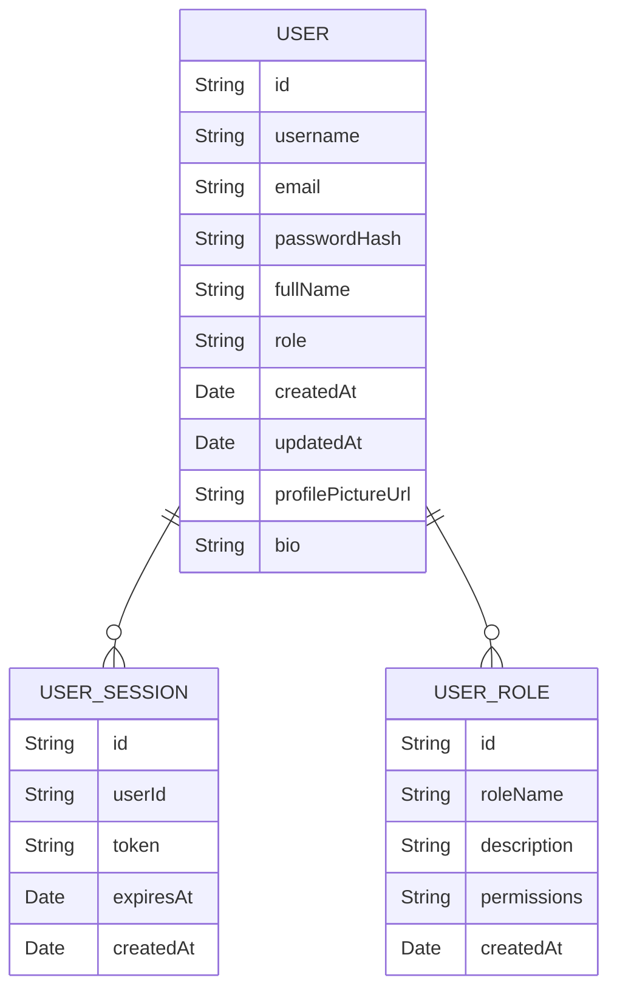

# ER-диаграмма для сервиса пользователей

```mermaid
erDiagram
    USER {
        String id
        String username
        String email
        String passwordHash
        String fullName
        String role
        Date createdAt
        Date updatedAt
        String profilePictureUrl
        String bio
    }

    USER_SESSION {
        String id
        String userId
        String token
        Date expiresAt
        Date createdAt
    }

    USER_ROLE {
        String id
        String roleName
        String description
        String permissions
        Date createdAt
    }

    USER ||--o{ USER_SESSION : ""
    USER ||--o{ USER_ROLE : ""
```